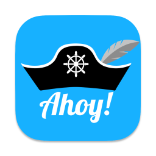

# Ahoy!

[Website](https://www.ahoyhelm.org) | [Github](https://github.com/oslabs-beta/Ahoy) | [Bugs/Features](https://github.com/oslabs-beta/Ahoy/issues)

## An easy-to-use GUI for Helm



Ahoy! is a GUI tool for DevOps engineers which distills the many functions of [Helm](https://helm.sh) into a user-friendly interface. A GUI visually aids all engineers (even those that love CLI) and better organizes the various configuration files. The ability to quickly revert to a previous version will give the DevOps engineer peace of mind.

### Built With

* [React](https://reactjs.org/), [Electron](https://www.electronjs.org/), [Semantic UI](https://semantic-ui.com/)


## Getting Started

Ahoy! requires a local Kubernetes cluster. To get one up and running, follow the steps below.

## Prerequisites

You'll want these things installed and running.
- [Helm](https://helm.sh)
- [MiniKube](https://minikube.sigs.k8s.io/)
- [Docker](https://www.docker.com)
- Helm Charts. Bring your own or download from https://artifacthub.io.

## Installation

Download the [latest release](https://github.com/oslabs-beta/Ahoy/releases) or clone the repo and build your own.

1. Clone the repo
   ```sh
   git clone https://github.com/oslabs-beta/Ahoy.git
   ```
2. Install dependancies
   ```sh
   npm install
   ```
3. Build
    ```
    npm run package-mac
    npm run package-windows
    npm run package-linux
    ```
## Usage

### Setup Environment

1. Launch the Docker Daemon
2. Start a MiniKube Kubernetes Cluster `minicube start`
3. Download charts (see below for location)
4. Launch Ahoy!

### Local Helm Chart Storage Paths

- macOS: `/Users/<username>/Library/Application\ Support/ahoy/charts`
- Windows: `C:\Users\<username>\AppData\Roaming\Ahoy\charts`

*Tip:*

Attach the node port to minikube node so you can see your cluster(s) in the browser.
  ```sh
  kubectl create deployment my-minikube --image=k8s.gcr.io/echoserver:1.4
  kubectl expose deployment my-minikube --type=LoadBalancer --port=8080
  ```


To launch the application in developer mode:
```
npm start
```

## Roadmap

See the [open issues](https://github.com/oslabs-beta/Ahoy/issues) for a list of proposed features (and known issues).

## Contributing

Contributions are what make the open source community such an amazing place to be learn, inspire, and create. Any contributions you make are **greatly appreciated**.

1. Fork the Project
2. Create your Feature Branch (`git checkout -b feature/AmazingFeature`)
3. Commit your Changes (`git commit -m 'Add some AmazingFeature'`)
4. Push to the Branch (`git push origin feature/AmazingFeature`)
5. Open a Pull Request to the `Staging` branch


## License

Distributed under the MIT License. See `LICENSE` for more information.

## Contributors

Joe Bigelow - [LinkedIn](https://www.linkedin.com/in/joe-bigelow-591a2170/) - [GitHub](https://github.com/lilbigs2001)

Tobey Forsman - [LinkedIn](https://www.linkedin.com/in/tobeyforsman/) - [GitHub](https://github.com/yebot)

Yoko Kawamoto - [LinkedIn](https://www.linkedin.com/in/yoko-kawamoto-95623047/) - [GitHub](https://github.com/libero-yoko)

Jin Oh - [LinkedIn](https://www.linkedin.com/in/jintoh613/) - [GitHub](https://github.com/ohjintech)

Project Link: [https://github.com/oslabs-beta/Ahoy](https://github.com/oslabs-beta/Ahoy)


<!-- ACKNOWLEDGEMENTS -->
## Acknowledgements

* [OS Labs](https://opensourcelabs.io/)
* [Matthew Marchand](https://www.linkedin.com/in/mnmarchand/)
* [horseQL](https://horseql.com/)
